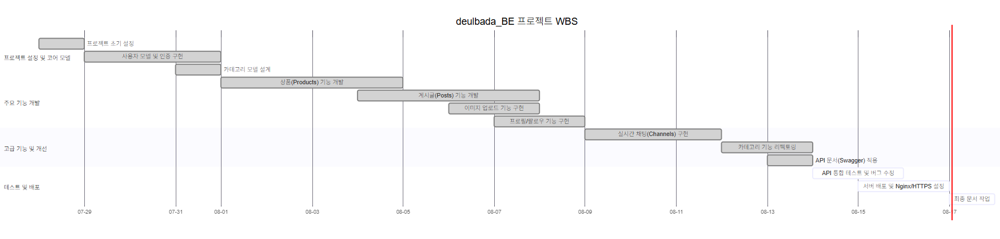
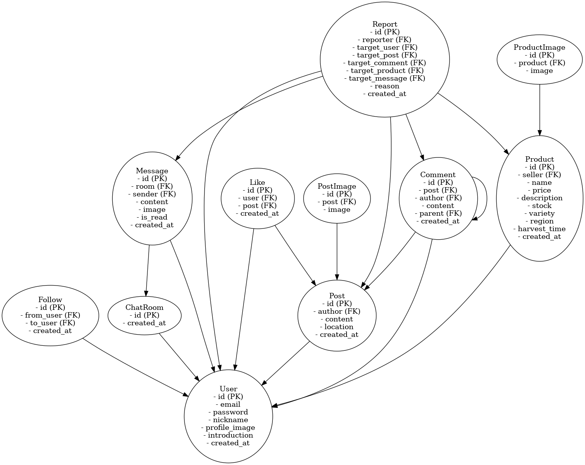
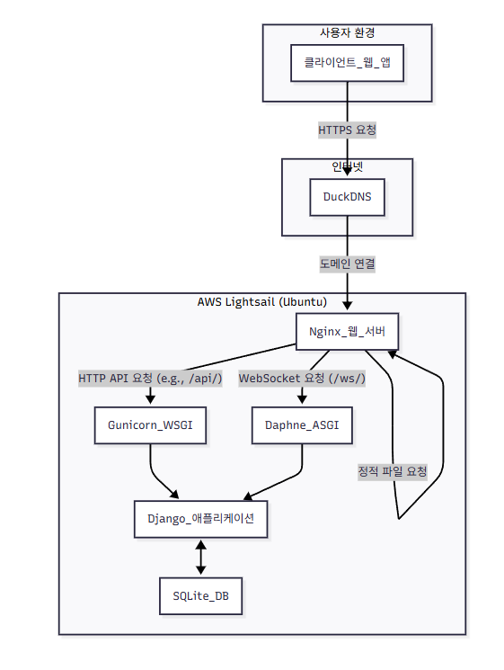

# deulbada_BE (들바다) BE 프로젝트 결과 보고서

## 1. 프로젝트 목표 및 주요 기능
### 1.1 프로젝트 목표
**들바다**는 신선하고 믿을 수 있는 농산물을 생산자와 소비자가 직접 거래하고 소통할 수 있는 온라인 마켓 및 커뮤니티 플랫폼입니다. 이 프로젝트의 목표는 중간 유통 과정을 최소화하여 합리적인 가격에 농산물을 거래하고, 실시간 채팅 기능을 통해 생산자와 소비자 간의 신뢰를 구축하는 것입니다.

### 1.2 주요 기능
*   **사용자 관리:** JWT 기반의 안전한 사용자 인증 및 생산자/소비자 역할 분리
*   **상품 관리:** 카테고리별 상품 등록, 조회, 검색 및 필터링 기능
*   **이미지 처리:** AWS S3를 이용한 이미지 업로드 및 절대 경로 URL 제공
*   **실시간 채팅:** Django Channels(WebSocket)을 활용한 사용자 간 1:1 실시간 채팅
*   **커뮤니티:** 게시글 및 댓글 작성, 좋아요 기능을 통한 소통 공간
*   **API 문서화:** drf-yasg(Swagger)를 이용한 API 명세 자동화

---

## 2. 🚀 시작하기
이 프로젝트는 Django와 Django REST Framework를 기반으로 합니다.

1.  **레포지토리 클론**
    ```bash
    # git clone https://github.com/BAEJUWAN5316/deulbada_BE
    ```
2.  **의존성 설치**
    ```bash
    pip install -r requirements.txt
    ```
3.  **데이터베이스 마이그레이션**
    ```bash
    python manage.py migrate
    ```
4.  **서버 실행**
    ```bash
    python manage.py runserver
    ```

---

## 3. 📚 프로젝트 개요
*   **프로젝트 이름:** deulbada_BE (들바다 백엔드) 🌾
*   **프로젝트 설명:** 생산자와 소비자를 위한 농산물 직거래 및 소통 커뮤니티 플랫폼
*   **프로젝트 기간:** [25.07.28. ~ 25.08.17.] 📅
*   **프로젝트 노션:** [https://www.notion.so/23e46a298900807d8b7bfe34324d2f93]

---

## 4. 👨‍👩‍👧‍👦 팀원 및 팀 소개
백엔드 개발자
* 정효은 : users(회원가입, 로그인, 프로필, 팔로우 시스템 등), posts(게시글, 좋아요, 댓글, 대댓글 등)
* 배주완 : chat(채팅 텍스트, 이미지, 웹소켓 설정), products(상품, 가격, 카테고리 등)

## 5. 🛠️ 기술 스택
*   **Backend:** Django, Django REST Framework, Django Channels
*   **Database:** SQLite
*   **Infrastructure:** Nginx, Daphne, Gunicorn, AWS S3
*   **Authentication:** djangorestframework-simplejwt (JWT)
*   **API Documentation:** drf-yasg (Swagger)
*   **Others:** Pillow, django-filter, django-cors-headers

---

## 6. 🛠️ 환경
*   **배포 환경:** Nginx, Gunicorn, Daphne을 사용하여 정적/동적 요청 및 WebSocket 요청을 처리합니다. Let's Encrypt와 Certbot을 통해 HTTPS를 적용하여 보안을 강화했습니다.
*   **이미지 업로드 용량 제한:** 이미지 업로드 최대 용량은 5MB로 설정되어 있으며, Django (`DATA_UPLOAD_MAX_MEMORY_SIZE`)와 Nginx (`client_max_body_size`)에 모두 적용되었습니다.
*   **CI/CD:** GitHub Actions를 사용하여 main 브랜치에 push될 때 자동으로 테스트 및 배포를 진행합니다.
*   **브랜치 전략:**
    Main Branch: 배포 가능한 상태의 코드를 유지합니다. 모든 배포는 이 브랜치에서 이루어집니다.
    Dev Branch: 배포를 위한 개발 브랜치입니다. 모든 기능 개발 취합이 해당 브랜치에서 이루어지며 로컬 테스트 후 Main Branch에 병합됩니다.
    feature/개발자: BE 각 개발자 로컬에서 진행되는 브랜치입니다. 맡은 기능을 개발한 후 Dev브랜치로 전달됩니다.

---

## 7. 🛠️ 개발
*   **JWT 인증:** `djangorestframework-simplejwt`를 사용하여 토큰 기반의 stateless 인증 시스템을 구현했습니다.
*   **실시간 채팅:** `Django Channels`를 사용하여 WebSocket 기반의 1:1 실시간 채팅 기능을 구현했습니다. 비동기 컨슈머를 통해 메시지를 실시간으로 처리하고 브로드캐스팅합니다.
*   **이미지 URL 절대 경로 반환:** API 응답 시 상품 및 사용자 프로필 이미지 URL이 상대 경로가 아닌 전체 주소(절대 경로)로 반환되도록 `Serializer`의 `to_representation` 메소드와 모델의 `get_profile_image_url` 메소드를 커스텀하여 구현했습니다. 이를 통해 프론트엔드에서 별도의 URL 조합 없이 바로 이미지를 표시할 수 있도록 편의성을 높였습니다.
*   **계층형 카테고리 리팩토링:** `Product` 모델의 카테고리 필드를 `CharField`에서 `ForeignKey`로 변경하여 데이터 정합성을 높이고, 1차/2차 카테고리 정보를 API에서 명시적으로 분리하여 반환하도록 `Serializer`를 개선했습니다. 또한, 1차 카테고리 기반의 상품 필터링 기능을 추가하여 사용성을 향상시켰습니다.
*   **커스텀 관리 명령어:** `populate_categories`와 같은 커스텀 `manage.py` 명령어를 작성하여 개발 환경에서 초기 카테고리 데이터를 쉽게 생성할 수 있도록 개발 편의성을 높였습니다.
*   **상품 이미지 업로드 제한:** 상품 당 이미지 업로드 개수를 1장으로 제한하고, 관련 모델 및 Serializer 로직을 수정하여 정책을 반영했습니다.

---

## 8. 📅 개발일정(WBS)


---

## 9. 🗄️ 데이터베이스 모델링(ERD)

---

## 10. 🏗️ 프로젝트 아키텍처
본 프로젝트는 AWS Lightsail 가상 서버에 Ubuntu OS를 기반으로 배포되었습니다. Nginx를 웹 서버 및 리버스 프록시로 사용하여 요청을 분산하고, Gunicorn과 Daphne을 각각 WSGI, ASGI 서버로 두어 동기 및 비동기 요청을 효율적으로 처리합니다.



### 컴포넌트별 역할
*   **DuckDNS:** Lightsail 인스턴스의 유동 IP에 고정된 도메인 이름을 제공하여 사용자가 쉽게 서비스에 접근할 수 있도록 합니다.
*   **Nginx:**
    *   **리버스 프록시:** 외부의 모든 HTTP(80) 및 HTTPS(443) 요청을 받아 내부 애플리케이션 서버로 전달합니다.
    *   **요청 분기:** 요청 경로에 따라 일반 API 요청은 Gunicorn으로, WebSocket 관련 요청은 Daphne으로 전달하여 트래픽을 효율적으로 분배합니다.
    *   **정적 파일 서빙:** `collectstatic`으로 수집된 정적 파일(CSS, JS 등)을 Django를 거치지 않고 직접 서빙하여 부하를 줄입니다.
    *   **SSL/TLS 처리:** Let's Encrypt로 발급받은 인증서를 사용하여 HTTPS 통신을 암호화합니다.
*   **Gunicorn:** WSGI(Web Server Gateway Interface) 서버로서, Nginx로부터 전달받은 동기적인 HTTP 요청을 처리하여 Django 애플리케이션과 통신합니다.
*   **Daphne:** ASGI(Asynchronous Server Gateway Interface) 서버로서, 실시간 채팅을 위한 WebSocket 연결(`wss://`)을 처리합니다. Nginx로부터 전달받은 비동기 요청을 Django Channels와 연결합니다.
*   **Django Application:** 프로젝트의 핵심 비즈니스 로직을 처리하는 메인 애플리케이션입니다.
*   **SQLite:** 개발 및 소규모 운영 환경에서의 데이터 저장을 위한 경량 데이터베이스입니다.

---

## 11. 🌟 메인 기능 상세
*   **사용자 관리:** 회원가입(일반, 생산자), 로그인, 프로필 관리, 팔로우/언팔로우, 사용자 검색 및 신고 기능
*   **상품 관리:** 상품 CRUD, 카테고리/사용자별 상품 목록 조회, 태그 기반 상품 검색
*   **게시글/커뮤니티:** 게시글 및 댓글 CRUD, 게시글 좋아요, 사용자별 작성 게시글 조회
*   **실시간 채팅:** 채팅방 생성 및 목록 조회, 채팅방 메시지 조회 및 실시간 송수신
*   **이미지 업로드:** 다중 이미지 업로드 및 개별 삭제 기능
*   **카테고리 관리:** 전체 카테고리 목록 조회 및 관리

---

## 12. 📂 프로젝트 구조
```
C:.
│  .gitignore
│  manage.py
│  db.sqlite3
│  requirements.txt
│  README.md
│
├─.github
│  └─workflows
│          main.yml
│
├─categories
│  │  models.py
│  │  serializers.py
│  │  urls.py
│  │  views.py
│  └─migrations
│
├─chat
│  │  consumers.py
│  │  models.py
│  │  routing.py
│  │  serializers.py
│  │  urls.py
│  │  views.py
│  └─templates
│
├─config
│  │  settings.py
│  │  urls.py
│  │  asgi.py
│  │  wsgi.py
│
├─core
│  ├─models
│  ├─exceptions
│  └─...
│
├─posts
│  │  models.py
│  │  serializers.py
│  │  urls.py
│  │  views.py
│  └─migrations
│
├─products
│  │  models.py
│  │  serializers.py
│  │  urls.py
│  │  views.py
│  └─migrations
│
├─uploads
│  │  models.py
│  │  serializers.py
│  │  urls.py
│  │  views.py
│  └─migrations
│
└─users
   │  models.py
   │  serializers.py
   │  signals.py
   │  urls.py
   │  views.py
   └─migrations
```

---

## 13. 📝 API 명세서

### ☑︎ users
| HTTP Method | URL Pattern                               | Description                    |
|-------------|-------------------------------------------|--------------------------------|
| POST        | /api/users/signup/                        | 일반 사용자 회원가입           |
| POST        | /api/users/signup/producer/               | 생산자 사용자 회원가입         |
| POST        | /api/users/login/                         | 로그인 (토큰 발급)             |
| POST        | /api/users/token/refresh/                 | 토큰 재발급                    |
| GET         | /api/users/check-email/                   | 이메일 중복 확인               |
| GET         | /api/users/check-account-id/              | 계정 ID 중복 확인              |
| GET/PUT     | /api/users/mypage/profile/                | 내 프로필 조회 및 수정         |
| GET         | /api/users/profiles/<str:account_id>/     | 특정 사용자 프로필 조회        |
| POST        | /api/users/profiles/<str:account_id>/follow/ | 사용자 팔로우/언팔로우         |
| GET         | /api/users/search/                        | 사용자 검색                    |
| POST        | /api/users/report/                        | 사용자 신고                    |

### ☑︎ products
| HTTP Method | URL Pattern                               | Description                    |
|-------------|-------------------------------------------|--------------------------------|
| GET/POST    | /products/                                | 상품 목록 조회 및 생성         |
| GET/PUT/DELETE | /products/<int:pk>/                      | 특정 상품 상세, 수정, 삭제     |
| GET         | /products/category/<str:category_name>/   | 카테고리별 상품 목록 조회      |
| GET         | /products/tags/                           | 전체 태그 목록 조회            |

### ☑︎ posts
| HTTP Method | URL Pattern                               | Description                    |
|-------------|-------------------------------------------|--------------------------------|
| GET/POST    | /posts/                                   | 게시글 목록 조회 및 생성       |
| GET/PUT/DELETE | /posts/<int:id>/edit/                    | 특정 게시글 상세, 수정, 삭제   |
| POST        | /posts/<int:post_id>/like/                | 게시글 좋아요 토글             |
| GET/POST    | /posts/<int:post_id>/comments/            | 댓글 목록 조회 및 생성         |
| PUT/DELETE  | /posts/comments/<int:id>/                 | 특정 댓글 수정 및 삭제         |

### ☑︎ chat
| HTTP Method | URL Pattern                               | Description                    |
|-------------|-------------------------------------------|--------------------------------|
| GET/POST    | /chat/chatrooms/                          | 채팅방 목록 조회 및 생성       |
| GET/DELETE  | /chat/chatrooms/<int:pk>/                 | 특정 채팅방 조회 및 삭제       |
| GET/POST    | /chat/chatrooms/<int:room_id>/messages/   | 채팅방 메시지 목록 및 전송     |

### ☑︎ categories
| HTTP Method | URL Pattern                               | Description                    |
|-------------|-------------------------------------------|--------------------------------|
| GET/POST    | /categories/                              | 카테고리 목록 조회 및 생성     |
| GET/PUT/DELETE | /categories/<int:pk>/                    | 특정 카테고리 상세, 수정, 삭제 |

### ☑︎ uploads
| HTTP Method | URL Pattern                               | Description                    |
|-------------|-------------------------------------------|--------------------------------|
| GET/POST    | /api/uploads/images/                      | 이미지 업로드 및 목록 조회     |

---

## 14. 🛠️ 트러블슈팅

### 1. 채팅방 비참여 사용자 접근 및 메시지 송수신 문제
*   **증상:** 채팅방에 참여하지 않은 제3의 사용자가 웹소켓에 연결하고, 해당 채팅방의 메시지를 실시간으로 수신 및 발신할 수 있는 심각한 보안 문제 발생.
*   **원인:** `chat/consumers.py`의 `ChatConsumer`에서 웹소켓 `connect` 시, JWT 토큰 유효성만 검증할 뿐, 인증된 사용자가 요청한 채팅방의 실제 참여 멤버인지 확인하는 인가(Authorization) 로직이 누락됨.
*   **해결책:**
    1.  사용자가 특정 채팅방의 멤버(`user1` 또는 `user2`)인지 확인하는 `is_chat_room_member` 헬퍼 함수를 `ChatConsumer`에 추가.
    2.  `connect` 함수 내에서 사용자 인증 직후, `is_chat_room_member` 함수를 호출하여 멤버가 아닐 경우 `4003 Permission Denied` 코드를 반환하며 웹소켓 연결을 강제로 종료하도록 수정.
*   **깨달은 점:** 인증(Authentication)과 인가(Authorization)는 명확히 분리하여 처리해야 한다는 점을 다시 한번 상기함. 특히 실시간 웹소켓 통신에서는 `connect` 시점의 인가 처리가 매우 중요함을 깨달음.

### 2. 채팅방 목록 API 필터링 부재 문제
*   **증상:** `/chat/chatrooms/` API 호출 시, 현재 로그인한 사용자가 참여한 채팅방만 보여주는 것이 아니라, 데이터베이스에 있는 모든 채팅방 목록이 반환되는 문제 발생.
*   **원인:** `chat/views.py`의 `ChatRoomListCreateView`에서 `queryset = ChatRoom.objects.all()`로 설정되어 있어, 모든 채팅방 객체를 필터링 없이 조회하고 있었음.
*   **해결책:**
    1.  `queryset` 속성을 제거하고 `get_queryset` 메소드를 오버라이딩.
    2.  `get_queryset` 내에서 `self.request.user`를 사용하여 현재 로그인한 사용자를 가져옴.
    3.  `Q` 객체를 사용하여 `user1` 또는 `user2` 필드에 현재 사용자가 포함된 `ChatRoom` 객체만 필터링하여 반환하도록 로직 수정. (`ChatRoom.objects.filter(Q(user1=user) | Q(user2=user))`)
    4.  상세 조회(`Retrieve`) API인 `ChatRoomRetrieveUpdateDestroyView`에도 동일한 로직을 적용하여, 다른 사용자가 URL 추측을 통해 채팅방에 접근하는 것을 방지.
*   **깨달은 점:** 민감한 정보를 다루는 API는 반드시 사용자 권한에 따라 데이터가 필터링되어야 하며, 목록 조회(List) 뿐만 아니라 상세 조회(Retrieve) 등 모든 관련 API에 일관된 권한 제어를 적용해야 함을 배움.

### 3. 데이터베이스 마이그레이션 충돌
*   **증상:** 모델 필드 변경 후 `migrate` 실행 시, 기존 마이그레이션 파일과 충돌하여 오류 발생.
*   **원인:** 개발 과정에서 모델 구조를 여러 번 변경하면서 마이그레이션 히스토리가 꼬임.
*   **해결책:**
    1.  개발 환경에서 `db.sqlite3` 데이터베이스 파일을 삭제.
    2.  문제가 발생한 앱(`products`)의 `migrations` 폴더 내 `__init__.py`를 제외한 모든 마이그레이션 파일을 삭제.
    3.  `django_migrations` 테이블에서 해당 앱의 마이그레이션 기록을 삭제 (`DELETE FROM django_migrations WHERE app = 'products';`).
    4.  `makemigrations`로 새 마이그레이션 파일을 생성하고, `migrate --fake-initial` 또는 `migrate`를 실행하여 데이터베이스 상태와 마이그레이션 상태를 동기화.
*   **깨달은 점:** 팀원과 협업 시 마이그레이션 충돌을 방지하기 위한 명확한 규칙(예: `migrate` 전 `pull` 필수)의 중요성을 느낌. 복잡한 마이그레이션 문제 발생 시, 개발 초기 단계에서는 데이터베이스를 초기화하는 것이 가장 빠른 해결책일 수 있음을 배움.

### 4. Nginx 설정 오류
*   **증상:** https로 변경을 위한 Nginx 설정 후 `502 Bad Gateway` 오류가 발생하거나, HTTPS 적용이 정상적으로 되지 않음.
*   **원인:** `proxy_set_header` 지시어의 오타 (`proxy_set_set_header`), `ALLOWED_HOSTS` 및 `CORS_ALLOWED_ORIGINS` 설정 방식의 차이 미인지.
*   **해결책:**
    1.  Nginx 설정 파일에서 오타를 수정.
    2.  `ALLOWED_HOSTS`에는 스킴(`http://`) 없이 도메인/IP만 명시하고, `CORS_ALLOWED_ORIGINS`에는 스킴을 포함한 전체 주소를 명시하도록 `settings.py`를 수정하여 문제를 해결.
*   **깨달은 점:** Django와 웹 서버(Nginx)의 각 설정 항목이 어떤 역할을 하는지 명확히 이해하는 것이 중요하며, 로그 파일을 꼼꼼히 확인하여 오류의 원인을 찾는 습관이 필요함을 느낌.

### 5. GitHub 브랜치 전략 및 충돌 문제
*   **증상:** 기능별로 브랜치를 생성하여 작업했으나, `Dev` 브랜치에 병합하는 과정에서 잦은 충돌(Conflict)이 발생하여 개발 시간이 지체됨.
*   **원인:** 팀원 간의 브랜치 전략에 대한 이해도 부족 및 병합 전 최신 코드를 반영하지 않은 상태에서 작업한 것이 원인.
*   **해결책:** Git Graph를 통해 브랜치 히스토리를 시각적으로 분석하고, 충돌이 발생한 파일을 하나씩 비교하며 직접 병합(Manual Merge)하여 해결. 이후, 기능 개발 전 항상 `Dev` 브랜치의 최신 코드를 `pull`하는 규칙을 수립하여 충돌을 최소화함.
*   **깨달은 점:** 명확한 브랜치 전략과 팀원 간의 꾸준한 소통, 그리고 `push` 전 최신 코드를 반영하는 습관이 협업의 핵심임을 배움.

### 6. 게시글 다중 이미지 업로드 기능 오류
*   **증상:** 게시글에 여러 이미지를 업로드하는 기능을 구현하는 과정에서, Serializer 유효성 검사에서 지속적으로 원인을 파악하기 힘든 오류가 발생하고 Swagger API 문서가 정상적으로 렌더링되지 않음.
*   **원인:** 이미지 객체를 생성(add)하고 삭제(delete)하는 로직에서, Serializer의 `context`를 통해 전달되어야 할 `request` 객체가 제대로 전달되지 않아 발생한 문제.
*   **해결책:** 이미지 Serializer를 리팩토링하여 `context`에 `request`를 명시적으로 포함시키고, 이미지 생성 및 삭제 로직을 보다 안정적으로 수정하여 해결.
*   **깨달은 점:** DRF Serializer의 `context`가 어떤 데이터를 담고 있으며, 중첩된 Serializer나 커스텀 로직에서 이를 어떻게 활용해야 하는지에 대한 깊은 이해가 필요함을 느낌.

### 7. 실시간 채팅 웹소켓 초기 설정 문제
*   **증상:** Django Channels와 Daphne을 처음 도입하여 실시간 채팅을 구현하는 과정에서, 웹소켓 연결이 제대로 이루어지지 않고 설정에 어려움을 겪음.
*   **원인:** `asgi.py`, `settings.py`의 Channels 관련 설정 및 `routing.py`의 URL 패턴과 Consumer 연결 부분에 대한 이해 부족.
*   **해결책:** 간단한 `chat_test.html` 파일을 만들어 최소한의 기능으로 웹소켓 연결을 테스트하며, Daphne 서버의 로그와 브라우저 개발자 도구의 네트워크 탭을 실시간으로 확인하며 문제 지점을 하나씩 찾아 해결.
*   **깨달은 점:** 새로운 기술을 도입할 때는 공식 문서를 참고하여 가장 간단한 'Hello, World' 예제부터 단계적으로 구현해보는 것이 중요하며, 문제가 발생했을 때 로그를 분석하는 능력이 필수적임을 배움.

---

## 15. 🧩 Coding Convention
이 프로젝트는 일관성 있고 가독성 높은 코드 품질을 유지하기 위해 다음과 같은 코딩 컨벤션을 따릅니다.

### 1. 일반 원칙
*   **Linter:** `flake8` 또는 `ruff`를 사용하여 코드 스타일을 검사합니다. (PEP 8 준수)
*   **Line Length:** 한 줄의 최대 길이는 120자로 제한합니다.
*   **Imports:** `isort` 규칙에 따라 다음 순서로 그룹화하여 정렬합니다.
    1.  Standard Library (e.g., `json`, `os`)
    2.  Third-Party Libraries (e.g., `django`, `rest_framework`)
    3.  Local Application Imports (e.g., `from users.models import User`)

### 2. 네이밍 컨벤션 (Naming Convention)
*   **변수, 함수:** `snake_case` (e.g., `room_name`, `get_queryset`)
*   **클래스, 모델:** `PascalCase` (e.g., `ChatRoom`, `ProductSerializer`)
*   **상수:** `UPPER_SNAKE_CASE` (e.g., `MAX_UPLOAD_SIZE`)
*   **URL 이름:** `kebab-case` (e.g., `name='product-list-create'`)

### 3. Django & DRF
*   **모델:**
    *   모든 모델은 `core.models.base.TimeStampedModel`을 상속하여 `created_at`과 `updated_at` 필드를 자동으로 포함합니다.
    *   `related_name`은 명확하게 지정하여 역참조 시 혼동을 방지합니다.
*   **뷰 (Views):**
    *   기능별로 명확하게 분리하기 위해 Class-Based Views (CBV) 사용을 원칙으로 합니다.
    *   DRF의 `generics` API View (`ListCreateAPIView`, `RetrieveUpdateDestroyAPIView` 등)를 적극 활용합니다.
*   **시리얼라이저 (Serializers):**
    *   `ModelSerializer`를 기본으로 사용하며, 커스텀 필드가 필요할 경우 `SerializerMethodField`를 활용합니다.
    *   `Meta` 클래스 내 `fields`에는 필요한 필드만 명시적으로 선언합니다. (`'__all__'` 사용 지양)

### 4. 커밋 메시지
Conventional Commits 명세를 따릅니다. 커밋 메시지는 다음 형식으로 작성합니다.
```
<type>(<scope>): <subject>
```
*   **Types:** `feat`(기능), `fix`(버그), `docs`(문서), `style`, `refactor`, `test`, `chore`(기타) 등
*   **Example:** `feat(chat): Add permission check to ChatConsumer`

---

## 16. 🤝 프로젝트 회고

### 1. 배주완
[배주완님의 회고를 입력해주세요.]

프론트엔드 개발자와의 첫 협업이면서 백엔드 개발또한 협업이 처음이라 어려우면서 조율해 나가는 부분이 전문가가 되어가는 것 같아서 흥미로웠다.
프론트로 어떻게 API가 전달되어야 하는 지, 백엔드 개발자들과는 어떻게 브랜치 전략을 가져가야 효율적인지 배웠고. 가장 크게 배운건 AI이다.
바이브 코딩을 적극 활용하면서 정말 말로 명령을 내리기만 해도 코드를 만들어 주는 것이 온다는 것을 여실히 느꼈다.
또한 그렇다고 해서 AI가 만능은 아니라는 것을 배웠다. 복잡한 구조일 수록 AI는 문제점을 해결하기 어려워 했고, 혼돈에 쉽게 빠졌다.
해결을 제시하지 못 한채 특정 부분을 맴돌게 되는데, 이때 강사님과 멘토님께 문의를 드리면 어디가 문제인지 한 번에 보시는 것을 보고는
'코드를 보는 눈'은 역시 필수임을 느낄 수 있었다.

### 2. 정효은
이번 프로젝트에서 사용자 인증(users)과 커뮤니티(posts) 기능을 맡으며 백엔드 개발자로서 첫걸음을 뗄 수 있었습니다. JWT를 이용해 로그인 시스템을 구현하면서 토큰 기반 인증의 흐름을 깊이 이해할 수 있었고, 팔로우와 게시글 좋아요 기능을 만들며 Many-to-Many 관계를 다루는 ORM 활용법을 익힐 수 있었습니다.

가장 어려웠던 점은 복잡한 쿼리를 효율적으로 작성하는 것이었습니다. 예를 들어, 게시글 목록을 가져올 때 각 게시글의 댓글 수와 좋아요 수를 함께 보여주기 위해 `annotate`와 `select_related`를 어떻게 사용해야 하는지 많은 고민을 했습니다. 처음에는 비효율적인 코드로 인해 불필요한 데이터베이스 조회가 많았지만, 팀원과 함께 리뷰하며 쿼리를 최적화하는 과정을 통해 성능의 중요성을 깨달을 수 있었습니다.

채팅 앱에서 발생한 보안 문제를 함께 해결하는 과정을 지켜보며, 제가 작성한 코드에도 테스트가 꼭 필요하다는 것을 절실히 느꼈습니다. 다음 프로젝트에서는 기능 구현과 동시에 테스트 코드를 작성하여 더 안정적이고 견고한 코드를 만들고 싶습니다. 함께 배우고 성장할 수 있도록 도와준 팀원에게 감사합니다.
